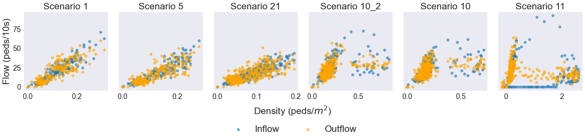

# Benchmarking Crowd Flow Prediction

## Dataset
* dataset: For in-distribution prediction.
* ood_dataset: For out-of-distribution prediction.
* scenario_dataset: For scenario-based prediction.
* sc sensor & sc sensor 2: The raw flow data for the train station model.


## Train Station Model
* train_station_model: The .mod file for the train station model.

## Simulation Visualization
<table>
<tr>
<td><figure>

  <figcaption>Train Delay</figcaption>
</figure></td>
<td><figure>

  <figcaption>High Demand</figcaption>
</figure></td>
<td><figure>

  <figcaption>Evacuation</figcaption>
</figure></td>
</tr>
</table>


## Extract the scenario data
`sc sensor` and `sc sensor 2` contain the raw flow data. For folder `sc sensor`, we have the following data structure:

```python
# Juptyer script
parent_dir = './sc sensor/'
# Initialize an empty dictionary to hold the dataframes
df_dict = {}
# Loop through each subdirectory in the parent directory
for subdir, dirs, files in os.walk(parent_dir):
    # Initialize an empty list to hold the dataframes for this subdirectory
    df_list = []
    # Loop through each file in the subdirectory
    files.sort()
    for filename in files:
        # Check if the file is a CSV file
        if filename.endswith('.csv'):
            # Read the CSV file into a dataframe
            df = pd.read_csv(os.path.join(subdir, filename), sep="\t", index_col="Index")
            # Append the dataframe to the list
            col_name = os.path.splitext(filename)[0]
            flow_data = np.stack([df["Left to Right"].values, df["Right to Left"].values, df["Sum"].values], axis=1)
            df_list.append(pd.Series([row for row in flow_data], name = col_name))
    # Concatenate all dataframes for this subdirectory into a single dataframe
    if df_list:
        df_concatenated = pd.concat(df_list, axis=1)
        # print(subdir)
        sorted_cols = sorted(df_concatenated.columns, key=lambda x: int(x.split('_')[1])) # sort the column name
        df_concatenated = df_concatenated.reindex(columns=sorted_cols)
        # Add the concatenated dataframe to the dictionary with the subdirectory name as the key
        df_dict[subdir] = df_concatenated
```
For folder `sc sensor 2`, use the following code:
```python
from lib.utils import process_sensor_data
# Define path to parent directory containing subdirectories with CSV files
parent_dir = './sc sensor 2/'
# Loop through each subdirectory in the parent directory
df_dict = process_sensor_data(parent_dir, df_dict)  # only process sensor 2
```

## Generate data to datadict, process data to matrix
```python
from lib.utils import gen_data_dict
data_dict = gen_data_dict(df_dict)
```

## Macroscopic Fundamental Diagram of Different scenarios
The following graph shows the macroscopic fundamental diagram of different scenarios.


